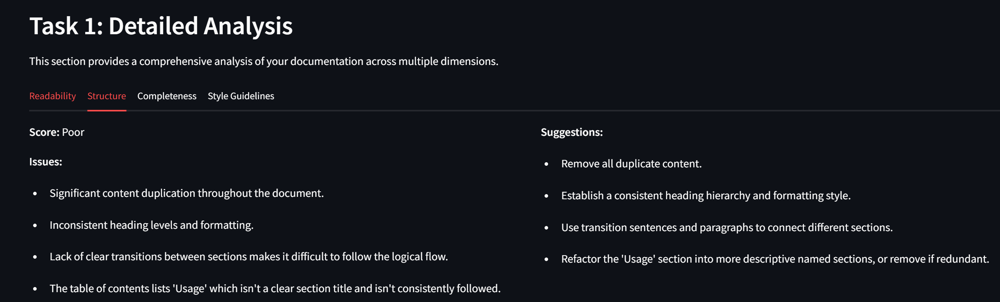

# DocuMetrics 🚀

<div align="center">


[](https://www.python.org/downloads/)
[](https://streamlit.io/)
[](https://python.langchain.com/)
[](LICENSE)

</div>

## 🚀 Overview

DocuMetrics is an intelligent documentation analysis platform powered by LangChain and Google's Gemini AI. Transform your documentation quality with advanced metrics and AI-driven insights.

### 🎯 Key Features

- **📊 Comprehensive Analysis**
  - Readability Assessment
  - Structure Evaluation
  - Completeness Check
  - Style Guidelines Compliance

- **🤖 AI-Powered Improvements**
  - Smart Content Recommendations
  - Auto-Generated Plain Text Revisions
  - Context-Aware Suggestions

- **💻 User-Friendly Interface**
  - Interactive Web Dashboard
  - Real-Time Analysis
  - One-Click Improvements
  - Downloadable Reports (JSON analysis, Plain Text revisions)

## 📸 Output Examples

### Task 1: Documentation Analysis

#### Analysis Dashboard

The analysis dashboard provides a comprehensive overview of your documentation's quality metrics, including readability scores, structural analysis, and style compliance.

#### Readability Assessment

Detailed breakdown of readability metrics including:
- Reading level assessment
- Sentence complexity analysis
- Technical jargon detection
- Clarity score

#### Content Analysis

Comprehensive content evaluation showing:
- Structure coherence
- Information completeness
- Technical accuracy
- Style consistency

### Task 2: Generate Revised Content

#### AI-Powered Revision

The revision interface where you can:
- Generate improved content with one click
- View side-by-side comparisons
- Track changes and improvements
- Accept or modify suggestions

#### Content Improvements

AI-powered suggestions for improving your documentation:
- Structure recommendations
- Style enhancements
- Clarity improvements
- Example additions

#### Export Options

Export options available:
- Plain text revised content (.txt)
- Improvement recommendations


## 🛠️ Installation

1. **Clone the Repository**
```bash
git clone https://github.com/lokesh0221/DocuMetrics
cd DocuMetrics
```

2. **Set Up Virtual Environment**
```bash
python -m venv venv
source venv/bin/activate  # On Windows: venv\Scripts\activate
```

3. **Install Dependencies**
```bash
pip install -r requirements.txt
```

4. **Configure Environment**
Create a `.env` file in the project root:
```
GEMINI_API_KEY=your_api_key_here
```

## 🚀 Usage

### 🌐 Web Interface

**Launch the Application**
```bash
streamlit run src/streamlit_app.py
```

### 📊 Features

1. **Documentation Analysis**
   - Enter your documentation URL
   - Get instant quality metrics
   - Review detailed feedback

2. **AI-Powered Improvements**
   - Generate revised content in plain text format (.txt)
   - Download improved versions
   - Track quality metrics

3. **Export Options**
   - JSON analysis reports
   - Plain text revised content (.txt format)
   - Detailed recommendations

## 🏗️ Current Project Structure

```
DocuMetrics/
├── src/
│   ├── __init__.py
│   ├── main.py           # CLI interface
│   ├── streamlit_app.py  # Web interface
│   ├── analyzer.py       # Core analyzer
│   ├── models.py         # Data models
│   └── utils.py          # Utilities
├── prompts/
│   ├── analysis.json     # Analysis templates
│   └── revision.json     # Revision templates
├── output/               # Generated content
├── requirements.txt      # Dependencies
└── README.md            # Documentation
```

## 🔧 Requirements

- Python 3.8+
- Google Gemini API key
- Internet connection
- Required Python packages:
  - streamlit
  - langchain
  - python-dotenv
  - google-generativeai

## 🤝 Contributing

We welcome contributions! Please follow these steps:

1. Fork the repository
2. Create a feature branch
3. Make your changes
4. Submit a pull request

## 📄 License

This project is licensed under the MIT License - see the LICENSE file for details.

## 🌟 Acknowledgments

- Powered by Google's Gemini AI
- Built with LangChain
- Streamlit for the web interface 